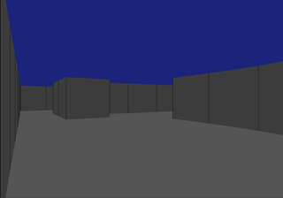
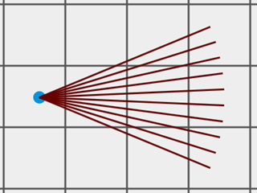
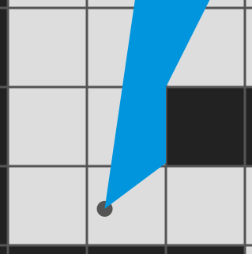
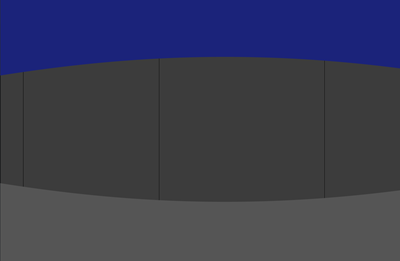
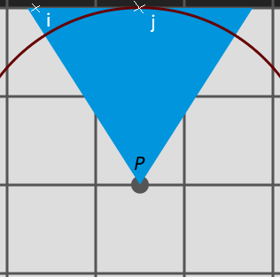
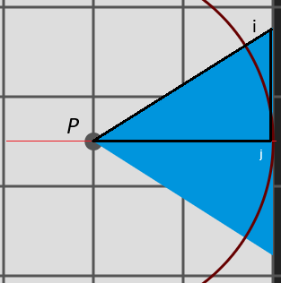
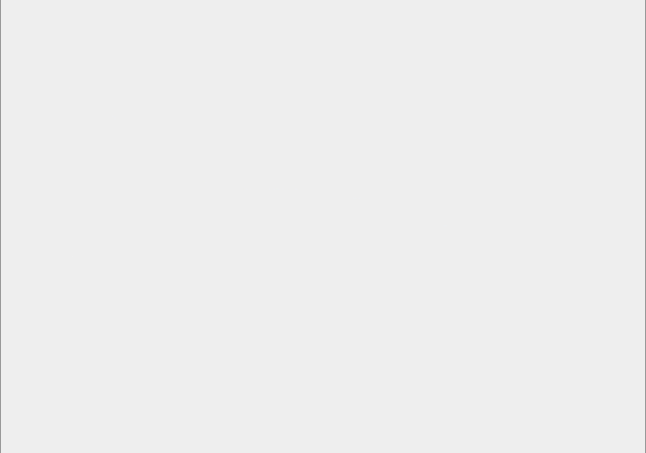

# 2.5D

3D Game using raycasting.

-   [Raycasting](#raycasting)
    -   [Principle](#principle)
    -   [Intersection Search](#intersection-search)
    -   [Segment Size](#segment-size)
    -   [Wall Texturing](#wall-texturing)
-   [Sprites](#sprites)
    -   [Animations](#animations)

## Raycasting

> [!WARNING]
> This section is based on information from an [article on permadi.com](https://www.permadi.com/tutorial/raycast/rayc7.html).

### Principle

Raycasting is a technique used to render a 3D space on a 2D plane by measuring the distance between the observer and the walls.



To achieve this, rays are cast (one ray per column of pixels of the screen), and a segment is drawn on the screen whose size depends on the distance to the wall.





### Intersection Search

The player $P$ is located at coordinates $(Px, Py)$ on a plane represented by a 2D array. Each cell has dimensions of 64x64.

```javascript
const mapLayout = [
    [1, 1, 1, 1, 1, 1, 1, 1, 1, 1],
    [1, 0, 0, 0, 0, 0, 0, 0, 0, 1],
    [1, 0, 0, 1, 1, 1, 1, 1, 0, 1],
    [1, 0, 0, 0, 0, 0, 0, 1, 0, 1],
    [1, 0, 0, 0, 1, 0, 0, 1, 0, 1],
    [1, 0, 0, 0, 1, 0, 0, 0, 0, 1],
    [1, 0, 0, 0, 0, 0, 0, 0, 0, 1],
    [1, 1, 1, 1, 1, 1, 1, 1, 1, 1],
];
// 0 for empty space, 1 for a wall
```

The direction the player is facing forms an angle $\alpha$ with the horizontal $X$ axis.

A set of rays is cast in a cone from $P$ within the field of view. The goal is to find the point of intersection between each ray and the nearest wall. Intersections may occur at the edges of each cell, either horizontally or vertically.

#### Horizontal Intersections

For horizontal intersections, we compute $Xa = 64 \div \tan(\alpha)$, the distance separating each horizontal intersection.

Let $A(Ax, Ay)$ be the first horizontal intersection:

|       |                                      |                              |
|-------|--------------------------------------|------------------------------|
| $Ay:$ | $\lceil Py \div 64 \rceil \times 64$ | if $(0 \leq \alpha \leq \pi)$ |
|       | $\lfloor Py \div 64 \rfloor \times 64$ | otherwise                    |

$Ax = Px + (Ay - Py) \div \tan(\alpha)$

Subsequent intersections are defined as:

-   $x_i = Ax + (Xa \times i)$
-   $y_i = Ay + (64 \times i)$

#### Vertical Intersections

For vertical intersections, we compute $Ya = 64 \times \tan(\alpha)$.

Let $B(Bx, By)$ be the first vertical intersection:

|       |                                      |                                                                        |
|-------|--------------------------------------|------------------------------------------------------------------------|
| $Bx:$ | $\lceil Px \div 64 \rceil \times 64$ | if $\Large(\frac{\pi}{2}$ $\leq \alpha \leq$ $\Large\frac{3\pi}{2})$ |
|       | $\lfloor Px \div 64 \rfloor \times 64$ | otherwise                                                              |

$By = Py + (Bx - Px) \times \tan(\alpha)$

Subsequent intersections are defined as:

-   $x_i = Bx + (64 \times i)$
-   $y_i = By + (Ya \times i)$

Once the points of intersection are calculated, the nearest wall can be identified, and its distance is used to render the corresponding segment.

---

### Segment Size

To calculate the segment size, divide the wall height (64 to match the cell dimensions) by the distance.

**Segment Size** = $64 \div \text{distance}$

#### Correcting Distances

Using the raw distance between the intersection $I$ and the player $P$ results in a fisheye distortion:



This distortion occurs because the rays are cast in a circular arc. For example, the distance $Pi$ is longer than $Pj$, even though they are on the same plane and should appear at the same distance.



To "correct" the distance, we adjust it relative to the field of view plane. The corrected distance ensures $Pi = Pj$. The correction formula is:

**Corrected Distance** = **distance** $\times \cos(\theta)$

Where $\theta$ is the angle between the ray and the player's direction:



Thus, the corrected segment size is:

**Segment Size** = $64 \div (\text{distance} \times \cos(\theta))$



### Wall Texturing

## Sprites

### Animations
